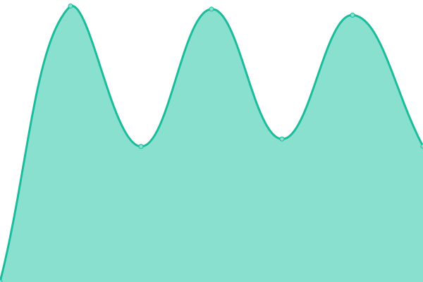

# [📈 Live Status](https://topfloormarketing.net): <!--live status--> **🟧 Partial outage**

This repository contains the open-source uptime monitor and status page for [Upptime](https://upptime.js.org), powered by [Upptime](https://github.com/upptime/upptime).

With [Upptime](https://topfloormarketing.net), you can get your own unlimited and free uptime monitor and status page, powered entirely by a GitHub repository. We use [Issues](https://github.com/upptime/upptime/issues) as incident reports, [Actions](https://github.com/upptime/upptime/actions) as uptime monitors, and [Pages](https://topfloormarketing.net) for the status page.

<!--start: status pages-->
<!-- This summary is generated by Upptime (https://github.com/upptime/upptime) -->
<!-- Do not edit this manually, your changes will be overwritten -->
<!-- prettier-ignore -->
| URL | Status | History | Response Time | Uptime |
| --- | ------ | ------- | ------------- | ------ |
|  [PBX](https://tfmpbx.app) | 🟩 Up | [pbx.yml](https://github.com/Careas/vps-monitor/commits/HEAD/history/pbx.yml) | 

 594ms
     
 | 

<a href="https://https://tfmpbx.app/history/pbx">100.00%</a>
    

|  [Google](https://www.google.com) | 🟩 Up | [google.yml](https://github.com/Careas/vps-monitor/commits/HEAD/history/google.yml) | 

 136ms
     
 | 

<a href="https://https://tfmpbx.app/history/google">100.00%</a>
    

|  [msn](https://www.github.com) | 🟩 Up | [msn.yml](https://github.com/Careas/vps-monitor/commits/HEAD/history/msn.yml) | 

 255ms
     
 | 

<a href="https://https://tfmpbx.app/history/msn">100.00%</a>
    

|  [TFM Site Site](https://topfloormarketing.net) | 🟩 Up | [tfm-site-site.yml](https://github.com/Careas/vps-monitor/commits/HEAD/history/tfm-site-site.yml) | 

 3056ms
     
 | 

<a href="https://https://tfmpbx.app/history/tfm-site-site">100.00%</a>
    

|  [1kingchimneyrepair](https://1kingchimneyrepair.com) | 🟩 Up | [1kingchimneyrepair.yml](https://github.com/Careas/vps-monitor/commits/HEAD/history/1kingchimneyrepair.yml) | 

 385ms
     
 | 

<a href="https://https://tfmpbx.app/history/1kingchimneyrepair">100.00%</a>
    

|  [TFM.main](190.181.131.162) | 🟥 Down | [tfm-main.yml](https://github.com/Careas/vps-monitor/commits/HEAD/history/tfm-main.yml) | 

 0ms
     
 | 

<a href="https://https://tfmpbx.app/history/tfm-main">71.20%</a>
    

|  [Google DNS 1](8.8.4.4) | 🟩 Up | [google-dns-1.yml](https://github.com/Careas/vps-monitor/commits/HEAD/history/google-dns-1.yml) | 

 20ms
     
 | 

<a href="https://https://tfmpbx.app/history/google-dns-1">100.00%</a>
    

<!--end: status pages-->

[**Visit our status website →**](https://topfloormarketing.net)

## 📄 License

- Powered by: [Upptime](https://github.com/upptime/upptime)
- Code: [MIT](./LICENSE) © [Upptime](https://upptime.js.org)
- Data in the `./history` directory: [Open Database License](https://opendatacommons.org/licenses/odbl/1-0/)
